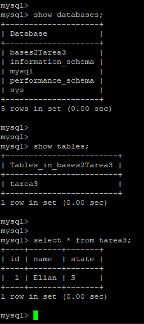

> # Tarea 3
> 
> ### Elian Saúl Estrada Urbina
> 
> #### 201806838

# Tarea 3 - Restaurar una Base de Datos MySQL en AWS

**1. Creamos la instancia en RDS**

**2. Creamos la base de datos**

Se creo la base de datos bases2Tarea3, se creo la tabla tarea3 y se inserto un registro.

**3. Creamos la instantanea de nuestra instancia de base de datos**

**4. Creamos un bucket S3**

En este caso el bucket se llama my-storage-db2

**5. Exportamos la instantanea al bucket S3**

Primero vamos a irnos a la instantanea que creamos previamente y la seleccionamos

Luego en el botón de Acciones vamos a escoger la que dice Exportar a Amazon S3: 

Se nos abrirá la siguiente página: 

**6. Configuración de la exportación a S3**

En la primera parte de configuración vamos a colocarle un nombre para identificar nuestra exportación: 

En este caso nuestra exportación se llamara _my-exportation-db2_, este nombre será el de nuestro archivo en el bucket de S3.

Luego escogeremos los datos a exportar, en este caso vamos a exportarlo de forma parcial, para así solo tomar la base de datos que nos interesa: 

Aquí se le indica que exporte solo la base de datos llamada _bases2Tarea3_ y la tabla de esa base de datos llamada _tarea3_

Luego procederemos a escoger el bucket que utilizaremos para almacenar nuestra exportación y asu vez también indicaremos la ruta de exportación:

Aquí podemos ver que escogimos el bucke que se creo al inicio y lo guardaremos en la siguiente ruta: **_bases2/tarea3/_**

Ahora se nos pedirá un rol de IAM, para ello vamos a escoger la opción de crear nuevo rol (en dado caso no lo tengamos creado) para así crear uno automaticamente y le asignamos un nombre: 

Aquí nuestro rol de IAM se llama _rds-s3-export-role_

Luego en la clave de ARN agregamos nuestra clave de cifrado: 

Ahora se nos indica que la exportación se estar realizando 

Una vez finalizado tendremos lo siguiente: 

Y al revisar el bucket tenemos: 

Nuestra carpeta bases2 fue creada

Nuestro archivo de exportación se encuentra en el bucket
